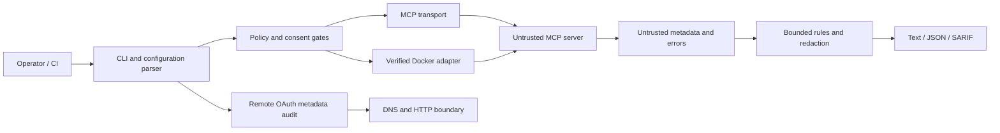

# Threat model

## Security objective

Help an operator inspect an MCP server before granting it broad trust, while ensuring the
scanner itself does not silently expand the target's authority.

## Assets

- host files and credentials;
- source code and repository metadata;
- network identity and internal services;
- OAuth tokens and authorization grants;
- integrity of reports and CI policy decisions;
- availability of the scanner host and CI runner.

## Trust boundaries

The target process, remote endpoint, DNS response, MCP metadata, error messages, tool
results, configuration file, and container image are treated as untrusted.

## Threats and controls

| Threat | Primary controls | Residual risk |
| --- | --- | --- |
| Arbitrary local code execution | `--execute`, allowlisted environment, timeout, optional Docker | Direct mode retains user privileges |
| Implicit harmful tool call | Discovery never calls tools; exercise requires name and consent | Named tool may still be malicious |
| Secret disclosure | No full env, synthetic fixtures, redaction, hashed exercise output | Unknown secret formats may evade redaction |
| SSRF and metadata service access | DNS resolution checks, private ranges blocked, no automatic redirects | DNS rebinding and proxy behavior need continued review |
| Resource exhaustion | body, item, page, process, PID, CPU, and memory limits | Kernel or runtime bugs can bypass expectations |
| Prompt injection in metadata | deterministic pattern rules; metadata never controls scanner instructions | Novel phrasing can evade heuristics |
| Misleading annotations | contradiction and destructive-name rules | Metadata alone cannot prove behavior |
| Mutable dependencies | exact npm versions, lockfile, SHA-pinned actions, digest-pinned image | Registries and build infrastructure remain dependencies |
| Tampered release | OIDC, provenance, SBOM, checksums, GitHub attestations | Account or repository compromise remains possible |
| Report injection | JSON serialization, bounded/redacted evidence, SARIF structure | Downstream viewers have their own parsers |

## Explicit non-claims

The project does not prove that a server is benign, protocol-conformant in every state,
free of vulnerabilities, or contained against a kernel-level exploit. It does not inspect
the semantic correctness of arbitrary tool results and does not replace source review,
malware analysis, network policy, or endpoint protection.

## Abuse cases

The scanner must not become a generic tool-invocation proxy, secret harvester, internal
network scanner, or malware execution service. Features that materially increase those
capabilities require a public design review and stronger isolation.
