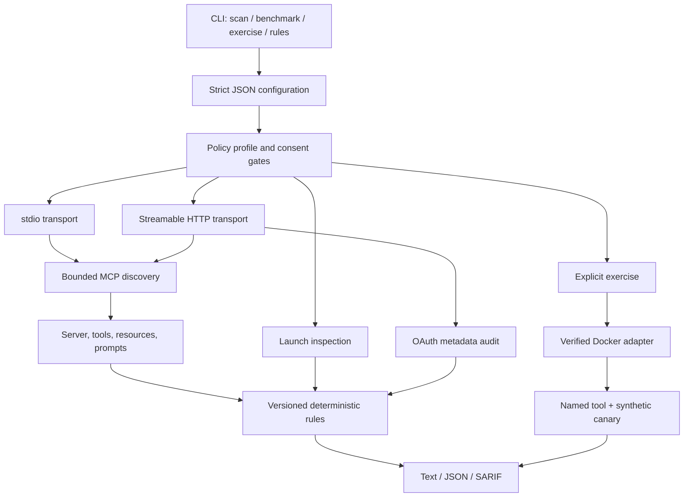

# Architecture

MCP Security Lab separates discovery, policy, execution, and reporting so that untrusted
server data never becomes control flow.

## Modules

| Module | Responsibility |
| --- | --- |
| `config.ts` | Parse JSON, normalize targets, and enforce numeric and enum bounds |
| `scanner.ts` | Connect transports, paginate discovery, collect metadata, never call tools |
| `auth-audit.ts` | Resolve safe destinations and inspect OAuth discovery metadata |
| `sandbox.ts` | Verify Docker and construct restrictive execution plans |
| `exercise.ts` | Run one explicit synthetic scenario and return digests |
| `rules/*` | Convert bounded evidence into versioned findings |
| `reporter.ts` | Emit deterministic text, JSON, and SARIF |
| `benchmark.ts` | Compare exact expected and actual finding sets |

## Data invariants

- Configuration is trusted only as operator intent, not as safe content.
- Target metadata and errors are untrusted strings.
- Transport responses are bounded before parsing.
- A `scan` report always records whether execution was requested, whether a connection was
  established, how many tools were invoked, and whether isolation was verified.
- `toolsInvoked` is always zero for `scan`.
- Findings are constructed from the catalog; call sites cannot redefine severity or
  recommendation.
- Scanner and rules versions are independent to support stable report consumers.

## Extension points

New transports must implement the same consent, destination, timeout, pagination, and
redaction controls. New sandbox adapters must prove a preflight and expose a truthful
`verified` state. New behavioral scenarios require exact tool names and cannot be added to
discovery.
